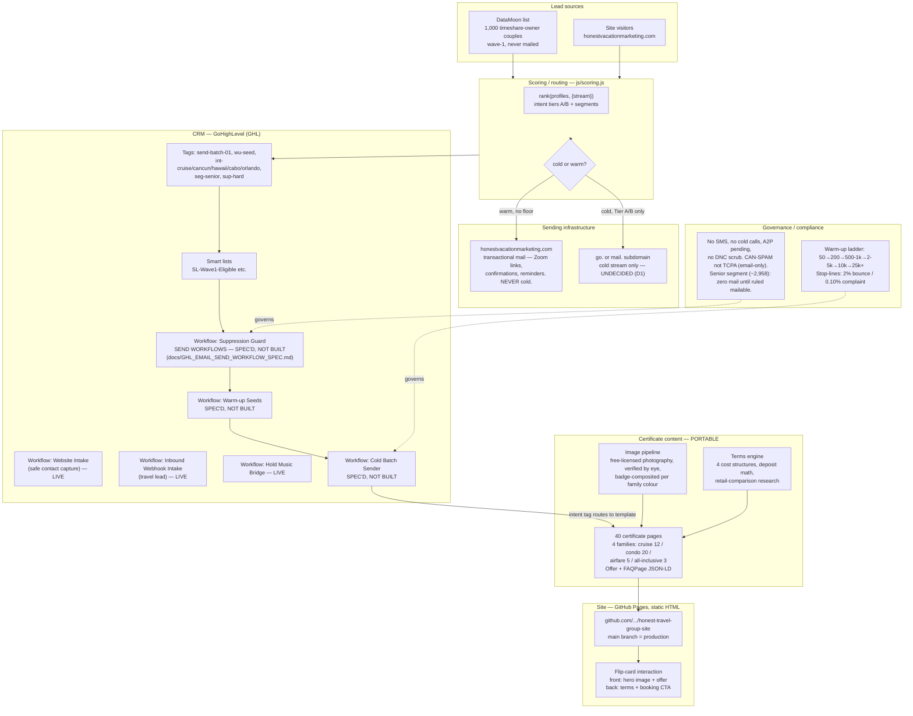

# HVM system wireframe — for a second sub-account under a different methodology

Purpose: paste this into Gemini so it understands what already exists before designing a
parallel build — same 40 certificate offers, different operational methodology (different
CRM, automation, or brand wrapper). Exported 2026-09-12.

## Account structure

**Elite Marketing Solutions LLC** (421 N Alisos St, Santa Barbara, CA 93103) is the master
account. Three sub-accounts sit under it:

| Sub-account | Role |
|---|---|
| **Honest Vacation Marketing (HVM)** | The *existing*, currently-live brand and stack described below — its own GHL instance, scoring script, and site. |
| **Show Up SB** | A separate sub-account/brand. Not otherwise described here. |
| **Honest Vacation Offers** | **New sub-account.** Reuses the 40 certificates below, under a different operational methodology than HVM's. This is what the rest of this document is scoped for. |

**So: the CONTENT layer (40 certificates) is copied from HVM into Honest Vacation Offers.
Everything in "Current stack" below is HVM's own build, shown so Gemini can decide what to
copy versus build differently for Honest Vacation Offers — a sibling sub-account under the
same Elite Marketing Solutions master, not a child of HVM.**

**Read this first: two layers, one portable, one not.**

| Layer | Portable to a new methodology? | Why |
|---|---|---|
| The 40 certificate offers (content, pricing, terms, imagery) | **Yes — copy as-is** | Product-level. Independent of any tool. |
| Everything below "Current stack" | **No — this is what gets replaced** | GHL, the scoring script, the site build are one specific implementation choice, not the product. |

---

## Diagram

---

## Current stack, plainly

| Function | Tool | State |
|---|---|---|
| Site hosting | GitHub Pages, static HTML/CSS/JS, no framework | **Live** |
| Version control | GitHub — `sbdavidjlemmons-hub/honest-travel-group-site` | **Live** |
| CRM | GoHighLevel (GHL) | 3 intake workflows live; **zero send workflows** |
| Lead scoring | Custom JS (`js/scoring.js`), cold/warm stream split | **Live** |
| Email templates | 5 long-form cold templates (cruise/cancun/hawaii/cabo/orlando) | Written, **not loaded into any send path** |
| Lead list | DataMoon, 1,000 couples | Built, **not imported into GHL** |
| Image sourcing | Manual research + AI agents, Pexels/Unsplash/Wikimedia, $0 budget, hand-verified | **Live**, ongoing |
| Storage/backup | Google Drive (`CERTIFICATE DESTINATIONS/` folder) | Mirror only, **stale** — one build behind production |
| Automation glue | **None.** No Zapier, no middleware, by policy | — |
| Data warehouse | Airtable | Was intended, **never connected** (OAuth never completed) |

## What has never shipped, ever

**Zero emails sent to a lead.** The entire distribution layer — CRM send workflows, the
1,000-contact list, the five templates — exists on paper/in the CRM UI but has never fired
a single cold message. This is the single biggest gap between "built" and "earning."

## The 5 decisions blocking distribution (unrelated to which methodology you pick)

1. Sending subdomain: `go.` vs `mail.` — two internal docs disagree
2. Senior segment (~2,958 contacts) — needs a written mailability ruling
3. Wave-1 eligible count — three sources disagree (4,059 / 4,859 / 4,876)
4. Charleston cruise certificate (CRU-CHA) — no cruise service exists from Charleston; retire or re-point
5. V5 "certificate-in-body" email template — approved-pending, not loaded

## What a new methodology would replace

Everything in the **CRM**, **Scoring**, and **Governance/Throttle** boxes above is
implementation, not product. A different sub-account could swap GHL for another CRM, replace
`scoring.js` with a different lead-routing logic, or use a different sending cadence —
**without touching a single certificate page, image, or price.** The `CONTENT` box is the
one thing that should be copied wholesale, not redesigned.

## What must never change regardless of methodology

- $0 budget on imagery — no paid stock, ever
- No third-party branding legible in any certificate image
- Deposit/charge language must match the 4 documented cost structures exactly
- No SMS, no cold calls, until A2P and DNC scrub are resolved
- Transactional mail (Zoom links, confirmations) never rides the cold stream
